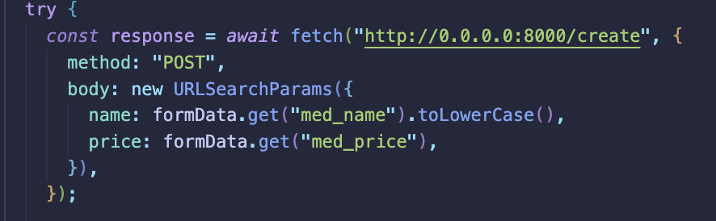

# Lilly Technical Challenge Documentation Template

*This documentation template serves as a place for you to discuss how you approached this challenge, any issues you faced & how you overcame them, or any other points that you feel would be relevant for the interviewers to know. The text in italics is here to guide you - feel free to remove it once you fill out each section!*

***Not every section in this document is required. This is just a template to help get you started. Feel free to add or remove sections as you feel necessary.***

## Approach
*How did you approach this challenge? Did you work through the objectives in any particular order? If so, why? Did you utilize any external resources, such as tutorials, guides, or other materials?*

Before staring this challenge, I wanted to have a plan before begining any implementations. I started by testing the API requests so I could see the backend data. After building the project, I used Postman to test out the different routes. I then browsed Pinterest for UI layouts for inspiration, after doing this and getting an initial plan I worked on the implementation.

I worked on fetching data from the backend first, making sure I could display it reliably. After this I worked on the UI implementation, going for something was was simple and worked.

I used a few resources to help with syntax, primarily for JS and CSS. I used W3Schools for some examples of certain things, such as CSS. For an issue I encourtered, the MDN web docs were very helpful for documentation of JS functions I was unfamiliar with.

## Objectives - Innovative Solutions
*For the challenge objectives, did you do anything in a particular way that you want to discuss? Is there anything you're particularly proud of that you want to highlight? Did you attempt some objectives multiple times, or go back and re-write particular sections of code? If so, why? Use this space to document any key points you'd like to tell us about.*

I am happy with my implementation of the table to display the medicines. While it is simple, it shows each medicine clearly without each one taking up too much space. An initial idea I had was to display each medicine in a tabular format, but this took up too much unnecessary space. While there is still lots of unfilled space in my final implementation, the way the table came out is something I am happy with.

I am also happy with the JS code. Some functions like the addFormEventListeners could definitely be refactored with less reused sections of code, however I like how it is relatively clean, and the first eventListener for the DOM makes it easy to see which functions are being executed when the page loads.

## Problems Faced
*Use this space to document and discuss any issues you faced while undertaking this challenge and how you solved them. We recommend doing this proactively as you experience and resolve the issues - make sure you don't forget! (Screenshots are helpful, though not required)*.

The largest problem I had was figuring out how to pass the form data to the backend with FastAPI. I was initally trying to pass the data as JSON data, but this was not working. A resource that helped massively with this was the MDN web docs again and stack overflow threads. After some digging and recognising that the FastAPI expects the data in the request body to be in the form application/x-www-form-urlencoded, I realised all I had to do was wrap the body with URLSearchParams.

Another issue I had was getting the CSS to work right. Getting the containers to line up how I wanted was a struggle. To get over this I used resources like W3Schools to help be see what I was getting wrong.

## Evaluation
*How did you feel about the challenge overall? Did some parts go better than others? Did you run out of time? If you were to do this again, and were given more time, what would you do differently?*

The challenge was really fun. I did run out of time in the end, just getting the basic routes working and the data displayed in a clear way. I was happy I managed to get it functioning decently. If I had more time I would have done more CSS to make it look a like nicer, and would have added other features. I intended to have some sort of search functionality, if I had more time I would have done that.

If I was to do it again, I would have probably planned a bit more before jumping into it. I spent a lot of time not working on things that contributed much to the functionality, had I not wasted that time I might have been able to add a couple more things.